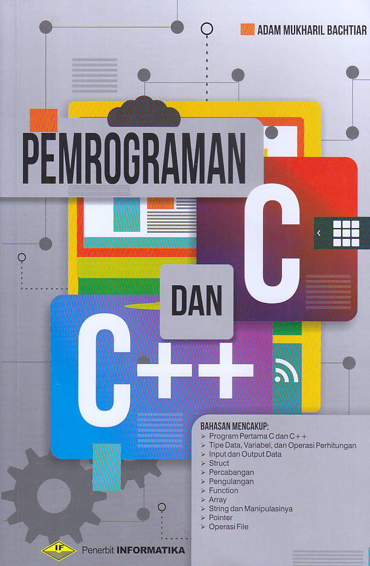

# Pemrograman C Dan C++

Programming C and C++ is a book written by Adam Mukharil Bachtiar

|           | Information              |
| --------- | ------------------------ |
| Title     | : Pemrograman C dan C++  |
| Author    | : Adam Mukharil Bachtiar |
| Publisher | : Informatika Bandung    |
| Prints    | : First 2017             |
| Language  | : Indonesian             |
| Pages     | : 323 Pages              |

### List of Contents

    1. Introduction
    2. First Program of C and C++
    3. Data Types, Variables, and Calculation Operations
    4. Data Input and Output
    5. Struct
    6. Branch
    7. Repeat
    8. Function
    9. Array
    10. Strings and Their Manipulation
    11. Pointer
    12. File operations

---

Note : _Please buy the book to support 💙_
